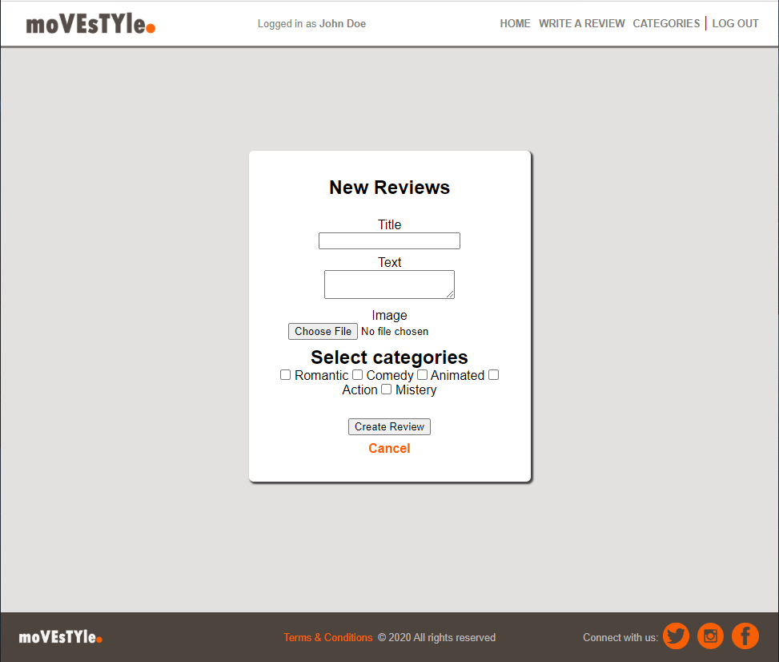

# Movie Reviews

> A Ruby web application


This is the implementation of an entire web application in which users can write reviews of the movies they like and don't like, to achieve that users most be signed-up, every person can see the home but just registered users can write new reviews, add new categories, and vote for their liked reviews.

## Built With

- Ruby v2.6.5
- Ruby on Rails Framework v5.2.4.3
- HTML
- CSS

## Live Demo

[Live Demo Link](https://salty-plains-41158.herokuapp.com/)


## Getting Started

**Follow the nex step if you want to run the project in you local machine 💻**

### Prerequisites

- Have a copy of this project
- Have Ruby v2.6.5 installed
- Have Ruby on Rails v5.2.4.3 installed

### Setup

- Clone this project running `git clone git@github.com:meme-es/movie-reviews.git`.
- Enter the movie-reviews folder.
- Run  `bundle` or `bundle install --without production` to install gems needed to run the project.
- Migrate the database with the next command `rails db:migrate`.
- Run the server with `rails server` or the short version `rails s`.
- Open the localhost:3000 in your favorite browser, and that's all.

### Usage

When you run the project using your machine as a local server then you can open the application in a web browser you will see a window like in the image in the top but without content, because you did not already write any review.

After running the project the first step is to create a user to let you use all the functions in the application, that functions are:

- Create reviews.



- Choose a category with related reviews by clicking on the image of the category.


- Vote for your favorite reviews making click over the thumbs-up icon, or undo your vote making click again.


### Run tests

If you want to check the test you have to open the root folder of the project and run the next instructions:

- `rspec`, this will run all the tests.
- `rspec <file_name>`, to run a specific file or folder stored in the spec folder.

If you experiment any trouble with the database you may need to make migration with the next instruction:

```
bin/rails db:migrate RAILS_ENV=test
```

Another important thing is that on some occasions the integration test could be to heave, some `sleep(5)` give time to the server to process some requests.

## Author

👤 **Manuel Muhun**

- Github: [@meme-es](https://github.com/meme-es)
- Twitter: [@meme_es](https://twitter.com/meme_es)
- Linkedin: [Manuel](https://www.linkedin.com/in/manuel-elias/)

## 🤝 Contributing

Contributions, issues and feature requests are welcome!

Feel free to check the [issues page](https://github.com/meme-es/movie-reviews/issues).

## Show your support

Give a ⭐️ if you like this project!

## 📝 License

This project is not licensed.